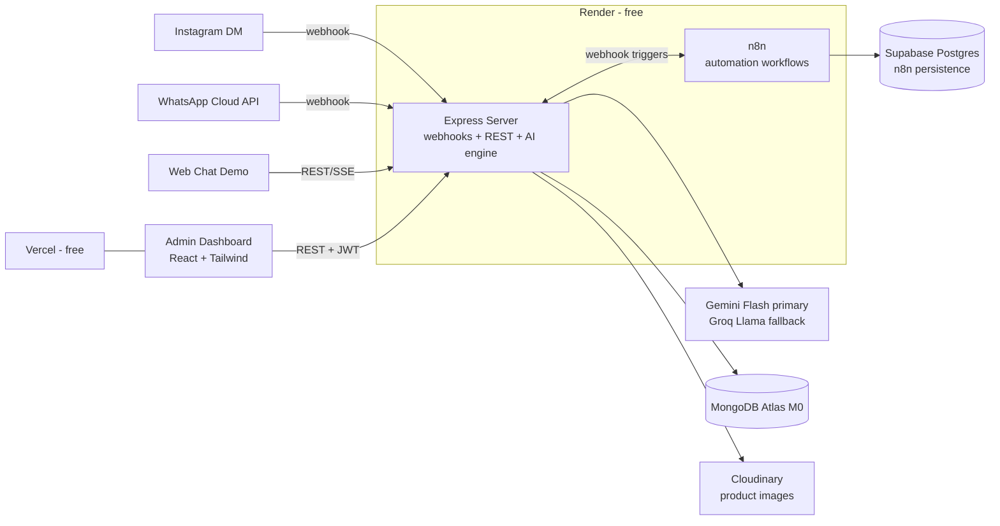

# Architecture

## System Overview



## Repository Layout (monorepo)

```
fashionhub/
├── client/          React 18 + Vite + Tailwind — dashboard, landing, web chat
├── server/          Node 20 + Express — API, webhooks, AI engine
├── n8n/             exported workflow JSONs + import guide
├── docs/            all project documentation
├── .claude/         agents + skills
└── fashionhub.pdf   original brief
```

## Tech Stack (with reasoning)

| Layer | Choice | Why |
|---|---|---|
| Frontend | React 18 + Vite + Tailwind CSS v4 | Brief mandates React/Tailwind; Vite for fast builds; static deploy on Vercel free |
| State/data | TanStack Query + zustand | Server cache + light client state, no Redux boilerplate |
| Backend | Node 20 + Express | Brief mandates; one service handles REST + Meta webhooks |
| Database | MongoDB Atlas M0 (free, 512MB) | Brief mandates MongoDB; Mongoose for schemas |
| AI primary | Google Gemini Flash (free tier, ~1500 req/day) | Free, fast, multimodal (handles voice transcription + Urdu natively) |
| AI fallback | Groq (Llama 3.3 70B, free tier) | Provider redundancy when Gemini rate-limits |
| AI orchestration | LangChain.js | Brief mandates; used for tool-calling, structured intent output, provider fallback chain |
| Automation | n8n (community, self-hosted on Render) | Brief mandates; Postgres backend on Supabase free so workflows survive restarts |
| Messaging | Meta WhatsApp Cloud API + Instagram Messaging API | Official, free test tier |
| Images | Cloudinary free tier | Product image hosting + transforms |
| Auth | JWT (admin) | Simple, stateless |

## AI Engine Design (server/src/ai)

Single pipeline used by ALL channels (Instagram, WhatsApp, web chat):

1. **Ingest** — normalize inbound message (text / voice→Gemini transcription / menu tap).
2. **Context** — load customer profile, conversation history (last N turns), preferences.
3. **Intent + sentiment** — one structured-output LLM call returns `{intent, sentiment, entities}`
   (entities: category, color, size, budget, city, order id…).
4. **Tools** — deterministic MongoDB queries: `searchProducts`, `checkStock`, `getSizeChart`,
   `getDeliveryInfo`, `trackOrder`, `createOrder`, `getPolicies`, `getUpsells`.
5. **Respond** — LLM composes the reply from tool results, in the customer's language
   (Urdu/English/Roman Urdu), tone adjusted to sentiment, with upsell suggestions when apt.
6. **Persist** — save message + reply + detected intent to Conversations collection.

Key rule: **product facts always come from the DB via tools, never from the model's head** —
this is what makes answers accurate.

Provider chain: Gemini Flash → on 429/error → Groq Llama → on failure → graceful
canned fallback ("agent will get back to you") so the bot never goes silent.

## Messaging Flow

- Meta sends webhook → Express verifies signature → responds 200 immediately →
  processes async → replies via Graph API / Cloud API within the 24h service window.
- n8n workflows (triggered by server webhooks): order-confirmation message,
  daily catalog broadcast prep, new-order admin notification, data export.

## Web Chat Demo

A public chat page on the frontend hitting the same AI pipeline — guarantees evaluators
can try the assistant instantly without Instagram/WhatsApp tester setup.

## Deployment Map (all free)

| Piece | Host | Notes |
|---|---|---|
| client | Vercel | static build, custom envs at build time |
| server | Render free web service | keep-alive ping every 10 min via cron-job.org |
| n8n | Render free web service (Docker) | Postgres persistence on Supabase free |
| MongoDB | Atlas M0 | |
| Images | Cloudinary free | |

## Constraints to design around

- Render free spins down after 15 min → keep-alive pings; webhooks must ACK fast.
- Gemini free = 10 RPM / ~1500 RPD → cache intent results, single-call design, Groq fallback.
- Meta dev mode → works only for tester accounts (fine for demo); document App Review path.
- WhatsApp free tier → replies within 24h window are free; use test number.
